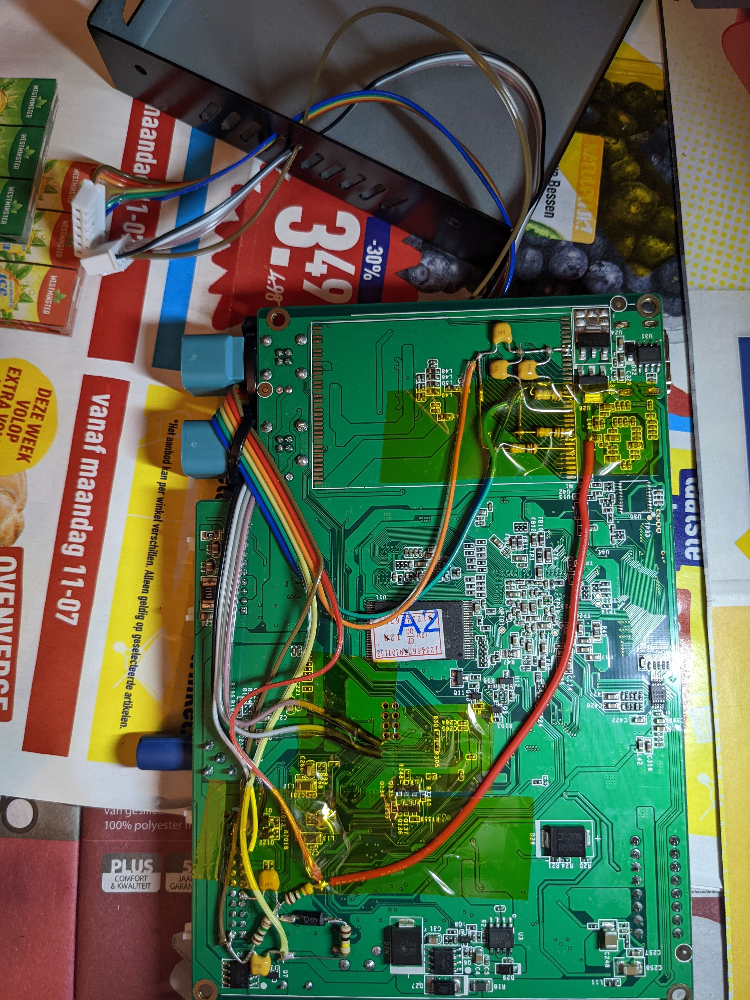
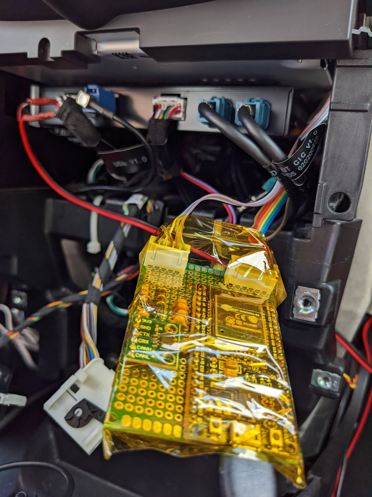
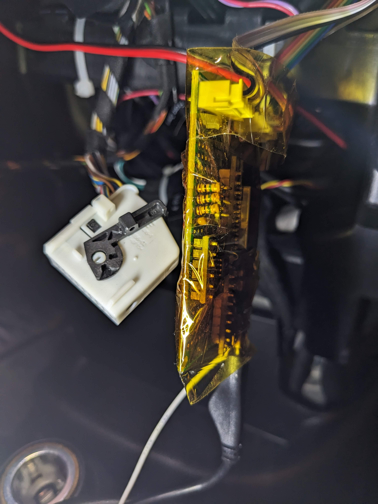
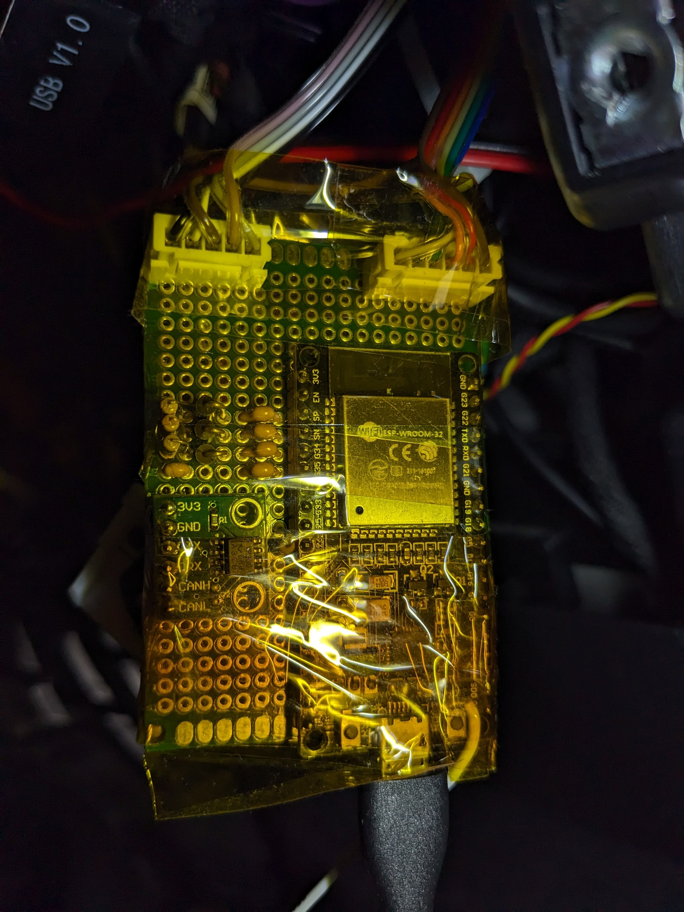

# AndroidAutoUnitAssist

**Note** Development is currently being done and code will be committed in the coming weeks when the device does something sensible. Reverse engineering of the CAN bus is being done to find some extra CAN IDs in addition to the CanWalkAndLock project https://github.com/asmaras/CanWalkAndLock.

An assistant to help overcome some flaws of the Road Top Carplay and Android Auto unit. It is specifically designed for the BMW/Mini CIC unit

The unit automatically switches between the original iDrive screen and it's own screen. It suffers from some flaws however in a few scenarios

## Fail scenarios

In the following text, these conventions are used:
- [idrive] = screen is switched to original idrive
- [unit] = screen is switched to the unit itself
- [cam] = same as [unit], while reverse or front camera is being displayed
- long-press home button switches screen

Example fail scenarios:
- Unlock the car -> [idrive] -> phone connects -> [unit] -> turn on ignition -> [idrive]
In this scenario the unit assumes the screen is still switched to [unit]. So if you long-press the home button it will switch to [idrive] which was already active, and nothing happens. The next long-press will switch over to [unit]
- [idrive] -> turn on ignition -> put gear in reverse -> [cam] -> phone connects while in reverse -> take gear out of reverse -> [idrive]
  \
  Here the unit should switch to [unit] because the phone is connected, however it doesn't. A long-press will switch over to [unit]

## Remedy

To assist the unit in making the correct screen switches, we connect the following I/Os:
- RGB
  \
  Analog inputs. Each color has an RC filter to obtain an average value for a coarse detection of what's being displayed
- audio
  \
  Analog input for a single audio channel. It is offset, rectified and filtered to be able to detect if audio is being played
- screen switch selection
  \
  A digital input showing the unit's selection for the screen switch ([idrive] or [unit])
- screen switch control
  \
  A digital output to control the screen switch, overriding the unit's selection
- cam enable
  \
  A digital input showing if the reverse or front camera is activated
- MJOY CAN bus
  \
  CAN bus to be able to send messages as if they were coming from the joystick. Also receives joystick messages

Let's add some more conventions for use with the inputs:
- \*boot\* = internally the unit's boot screen is being generated
- \*menu\* = internally the unit's menu screen is being generated
- \*CP/AA\* = internally the Carplay or Android Auto screen is being generated

The following start-up sequences are observed:
- [idrive] -> \*boot\* -> \*menu\* -> [unit] -> \*CP/AA\*
- [idrive] -> \*boot\* -> \*menu\* -> \*CP/AA\* (wrong screen shown)
- [idrive] -> \*boot\* -> [cam] -> [unit] -> \*menu\* -> \*CP/AA\*
- [idrive] -> \*boot\* -> [cam] -> [idrive] -> \*CP/AA\* (wrong screen shown)

With a few conditions, written in pseudo-code, the correct screen can be selected.

We define:
\
**T1**: period from startup to \*boot\*
\
**T2**: period from startup to \*menu\*. This period will be automatically detected
\
**T3**: time needed to detect \*menu\* level on the RGB inputs
\
**T4**: after the screen has been switched manually, wait this period before switching automatically again
\
**T5**: maximum long-press time

Conditions and resulting actions:
- start -> T2 -> not [cam] -> not \*menu\* level => \*CP/AA\* detected (T2 and \*menu\* level must be known)
- start -> \*menu\* level detected (event) -> stop T2 and go to "not \*menu\* level" in above condition check
- audio => \*CP/AA\* detected
- [unit] -> detect long press -> [idrive] => set manual override
- [unit] + not [cam] -> T4 => reset manual override
- [idrive] + \*CP/AA\* detected + not override => generate long press -> wait for [unit] or T5
- T5 expires -> generate another long-press

Detection of \*menu\* level:
- start -> [idrive] -> not [cam] -> T1 -> \*boot\* -> detect \*boot\* level -> \*menu\* -> detect transition -> set T2 period -> detect \*menu\* level -> T3 -> \*menu\* level detected
  \
  Detection will be cancelled when the screen switches to [unit] or when the cam enable input is active
  \
  [unit] means that the unit switched to it's own output. In that case it's probable that \*CP/AA\* is being generated making detection of the \*menu\* level impossible
  \
  When cam enable is active the camera is displayed, also making detection impossible

# Hardware

Below is a description of the connections between the unit and the assistant board, along with some pictures of the actual situation

Hooking up the I/Os to the unit:
|I/O|Location|
|-|-|
|R|SerDes pad 7|
|G|SerDes pad 10|
|B|SerDes pad 18|
|Audio|large connector upper row pin 5 and 6|
|Screen switch selection|right side of R305|
|Screen switch control|right side of R307|
|Cam enable|large connector lower row pin 13|
|MJOY CAN H|large connector upper row pin 9|
|MJOY CAN L|large connector upper row pin 10|

\
Pinout of JST connectors to assistant (6 + 5 pins):
```
  GND . . SSW sel
3.3 V . . SSW ctl
    R . . Cam en
    G . . MJOY CAN H
    B . . MJOY CAN L
    A .
```
\




